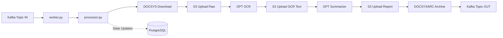
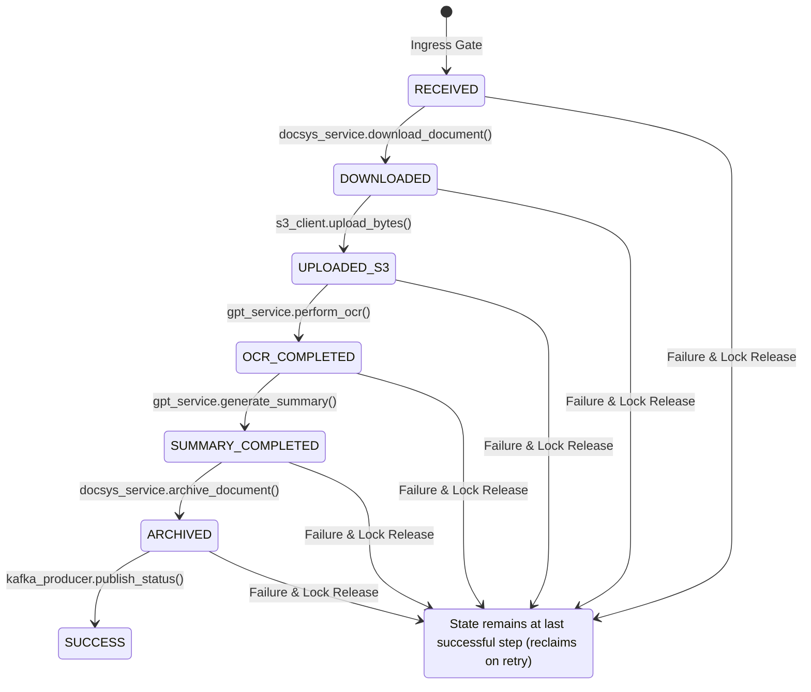
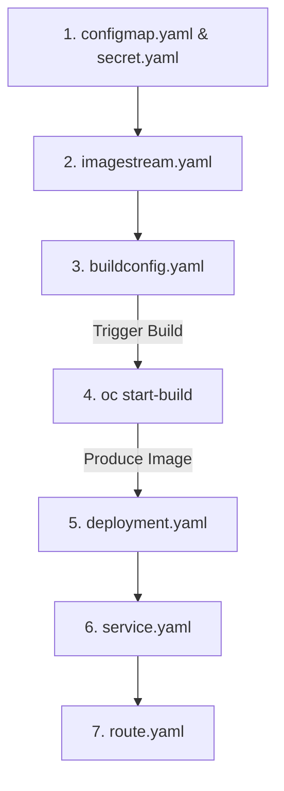

# OCR Summary Worker

An asynchronous event-driven pipeline designed to run on Red Hat OpenShift. The worker consumes processing events from Kafka, downloads source documents from a local API (`DOCSYS`), stores raw documents in AWS S3 (via a VPC Endpoint), performs OCR and summarization using a Secure GPT service (with tenacious retry logic), archives results back to a repository (`DOCSYSARC`), and publishes final event statuses to an output Kafka topic. 

All job states are persistently tracked in a PostgreSQL database acting as a State Machine, ensuring auditability and automatic crash recovery.

---

## Architecture



For more detailed diagrams, refer to the documentation:
* [Sequence Diagram](docs/sequence_diagram.mermaid)
* [Entity-Relationship (ER) Diagram](docs/er_diagram.mermaid)
* [Local Docker Compose Design](docs/docker_compose_design.md)

---

## Project Structure

```
python-ocr-summary-worker-openshift/
├── app/
│   ├── __init__.py
│   ├── __main__.py                # python -m app entry point
│   ├── worker.py                  # Kafka consumer loop + lifecycle
│   ├── config.py                  # Pydantic Settings — all env vars
│   ├── pipeline/
│   │   ├── __init__.py
│   │   └── processor.py           # 7-step sequential orchestrator
│   ├── services/
│   │   ├── __init__.py
│   │   ├── docsys_service.py      # DOCSYS + DOCSYSARC API client (HTTPX streaming)
│   │   └── gpt_service.py         # Secure GPT (OCR + Summary with tenacity retries)
│   └── core/
│       ├── __init__.py
│       ├── database.py            # asyncpg pool + state machine DB helper
│       ├── oidc_service.py        # OIDC M2M token fetcher & cache manager
│       ├── s3_client.py           # S3 client via VPC Endpoint (boto3)
│       └── kafka_producer.py      # aiokafka output producer
├── docs/
│   ├── implementation_plan.md     # Baseline implementation specification
│   ├── sequence_diagram.mermaid   # Mermaid-formatted sequential flow
│   ├── er_diagram.mermaid         # Mermaid-formatted state machine schema
│   ├── decoupled_worker_design.md # Multi-pod scaling architectural design document
│   └── docker_compose_design.md   # Local development compose and mock design document
├── mocks/                         # FastAPI mock APIs for offline local testing
│   ├── docsys/                    # Mock download service
│   ├── docsysarc/                 # Mock archival service
│   ├── gpt/                       # Mock OCR & summary service
│   └── oidc/                      # Mock M2M authentication provider
├── openshift/
│   ├── buildconfig.yaml           # OpenShift build pipeline configuration
│   ├── imagestream.yaml           # Local container image tracking catalog
│   ├── deployment.yaml            # Kubernetes Deployment workload runtime configuration
│   ├── configmap.yaml             # Non-sensitive settings parameters map
│   ├── secret.yaml                # Encrypted/opaque credentials parameters map
│   ├── service.yaml               # ClusterIP internal network resource
│   └── route.yaml                 # OpenShift Ingress mapping resource
├── Dockerfile                     # Multi-stage production image (non-root UID 1001)
├── requirements.txt               # Pinned dependencies
├── .env.example                   # Environment configuration template
├── .gitignore                     # Git ignore rules for Python, IDEs, and local envs
├── AGENTS.md                      # AI agent guidelines, design constraints, and rules
└── README.md                      # This file
```

---

## Suggested S3 Object Layout

To ensure clean isolation, auditing, and scalability, the object storage is organized systematically by `job_id` (UUID format). The suggested S3 folder layout structure in the bucket is:

```
s3://<S3_BUCKET_NAME>/
  └── jobs/
      └── <job_uuid>/
          ├── raw.<ext>           # Original file uploaded during Step 3
          ├── ocr.txt             # Raw plain text output from Step 4 (GPT OCR)
          └── report.txt          # Final summarized report text from Step 5 (GPT Summary)
```

### Layout Properties
* **UUID Partitioning**: Nesting objects under the job's unique UUID (`jobs/<job_uuid>/...`) avoids object name collisions and partition hotspots in S3.
* **Format Preservation**: The raw document retains its original extension (`.pdf`, `.docx`, `.png`, etc.), while text artifacts are saved as `.txt`.
* **Deterministic S3 Keys**: S3 keys are constructed dynamically using the `job_id` (e.g. `jobs/{job_id}/ocr.txt`). The database only stores the original `filename` (in the `filename` column) to identify the file extension for the raw S3 object.

---

## API Endpoints Reference

The worker communicates with three main HTTP endpoints. Their specifications are detailed below:

### 1. DOCSYS Download API
* **Purpose**: Download the original document payload.
* **Method**: `GET`
* **URL**: `{DOCSYS_BASE_URL}/api/v1/documents/{docid}/files/{fileid}/download`
* **Headers**:
  * `Authorization: Bearer {DOCSYS_API_TOKEN}` (or dynamically resolved OIDC token)
* **Behavior**: Streamed chunk-by-chunk using `httpx.AsyncClient` to prevent buffering files into memory. Extracts content type from `Content-Type` and filename from `Content-Disposition`.

### 2. Secure GPT OCR API
* **Purpose**: Perform Optical Character Recognition (OCR) on raw file bytes.
* **Method**: `POST`
* **URL**: `{GPT_BASE_URL}/api/v1/ocr`
* **Headers**:
  * `Authorization: Bearer {GPT_API_KEY}` (or dynamically resolved OIDC token)
  * `Content-Type: multipart/form-data`
* **Request Payload**:
  * `file`: Multipart file binary data
  * `model`: Selected GPT model name (e.g. `gpt-4o`)
* **Response Payload** (JSON):
  ```json
  {
    "text": "Extracted document text..."
  }
  ```
  *(Accepts `"content"` as a fallback property name)*

### 3. Secure GPT Chat completions (Summary) API
* **Purpose**: Generate a text summary report of the extracted OCR text.
* **Method**: `POST`
* **URL**: `{GPT_BASE_URL}/api/v1/chat/completions`
* **Headers**:
  * `Authorization: Bearer {GPT_API_KEY}` (or dynamically resolved OIDC token)
  * `Content-Type: application/json`
* **Request Payload** (JSON):
  ```json
  {
    "model": "gpt-4o",
    "messages": [
      {
        "role": "system",
        "content": "You are a document analyst. Summarize the following OCR text..."
      },
      {
        "role": "user",
        "content": "<raw_ocr_text>"
      }
    ]
  }
  ```
* **Response Payload** (JSON): Standard OpenAI chat response format:
  ```json
  {
    "choices": [
      {
        "message": {
          "content": "Generated summary report..."
        }
      }
    ]
  }
  ```

### 4. DOCSYSARC Archival API
* **Purpose**: Save the final processing output report.
* **Method**: `POST`
* **URL**: `{DOCSYSARC_BASE_URL}/api/v1/documents/{docid}/files/{fileid}/archive`
* **Headers**:
  * `Authorization: Bearer {DOCSYSARC_API_TOKEN}` (or dynamically resolved OIDC token)
  * `Content-Type: multipart/form-data`
* **Request Payload**:
  * `file`: Multipart binary document (e.g. filename `{docid}_{fileid}_report.txt`, MIME type `application/pdf`)
* **Response Payload** (JSON):
  ```json
  {
    "status": "success",
    "archive_id": "arc-12345"
  }
  ```

---

## Environment Variables

| Variable | Default | Description |
|---|---|---|
| `KAFKA_BOOTSTRAP_SERVERS` | `localhost:9092` | Comma-separated Kafka broker addresses |
| `KAFKA_INPUT_TOPIC` | `doc-processing-requests` | Topic the worker consumes from |
| `KAFKA_OUTPUT_TOPIC` | `doc-processing-results` | Topic the worker publishes results to |
| `KAFKA_GROUP_ID` | `ocr-summary-worker` | Consumer group ID |
| `KAFKA_SECURITY_PROTOCOL` | `PLAINTEXT` | `PLAINTEXT`, `SASL_PLAINTEXT`, or `SASL_SSL` |
| `KAFKA_SASL_MECHANISM` | *(unset)* | e.g. `SCRAM-SHA-512` |
| `KAFKA_SASL_USERNAME` | *(unset)* | SASL username |
| `KAFKA_SASL_PASSWORD` | *(unset)* | SASL password |
| `DATABASE_URL` | — | PostgreSQL connection string |
| `DB_POOL_MIN_SIZE` | `2` | Minimum asyncpg pool connections |
| `DB_POOL_MAX_SIZE` | `10` | Maximum asyncpg pool connections |
| `S3_BUCKET_NAME` | — | S3 bucket for document storage |
| `S3_ENDPOINT_URL` | — | S3 VPC Endpoint URL |
| `S3_REGION_NAME` | `ap-southeast-1` | AWS region |
| `S3_ACCESS_KEY_ID` | *(unset)* | Leave unset for IAM role / IRSA |
| `S3_SECRET_ACCESS_KEY` | *(unset)* | Leave unset for IAM role / IRSA |
| `DOCSYS_BASE_URL` | — | DOCSYS API base URL |
| `DOCSYS_API_TOKEN` | — | DOCSYS bearer token (fallback if OIDC is not configured) |
| `DOCSYSARC_BASE_URL` | — | DOCSYSARC archive API base URL |
| `DOCSYSARC_API_TOKEN` | — | DOCSYSARC bearer token (fallback if OIDC is not configured) |
| `GPT_BASE_URL` | — | Secure GPT API endpoint |
| `GPT_API_KEY` | — | Secure GPT API key (fallback if OIDC is not configured) |
| `GPT_MODEL` | `gpt-4o` | Model name for OCR and summarization |
| `GPT_TIMEOUT_SECONDS` | `300` | Request timeout for GPT calls |
| `GPT_MAX_RETRIES` | `3` | Retry attempts for transient GPT failures |
| `OIDC_TOKEN_URL` | — | Global fallback OIDC token endpoint URL |
| `OIDC_CLIENT_ID` | — | Global fallback OIDC client ID |
| `OIDC_CLIENT_SECRET` | — | Global fallback OIDC client secret |
| `OIDC_SCOPE` | `openid` | Global fallback OIDC scope |
| `OIDC_AUDIENCE` | — | Global fallback OIDC audience |
| `DOCSYS_OIDC_TOKEN_URL` | — | DOCSYS specific OIDC token endpoint URL |
| `DOCSYS_OIDC_CLIENT_ID` | — | DOCSYS specific OIDC client ID |
| `DOCSYS_OIDC_CLIENT_SECRET` | — | DOCSYS specific OIDC client secret |
| `DOCSYS_OIDC_SCOPE` | — | DOCSYS specific OIDC scope |
| `DOCSYS_OIDC_AUDIENCE` | — | DOCSYS specific OIDC audience |
| `DOCSYSARC_OIDC_TOKEN_URL` | — | DOCSYSARC specific OIDC token endpoint URL |
| `DOCSYSARC_OIDC_CLIENT_ID` | — | DOCSYSARC specific OIDC client ID |
| `DOCSYSARC_OIDC_CLIENT_SECRET` | — | DOCSYSARC specific OIDC client secret |
| `DOCSYSARC_OIDC_SCOPE` | — | DOCSYSARC specific OIDC scope |
| `DOCSYSARC_OIDC_AUDIENCE` | — | DOCSYSARC specific OIDC audience |
| `GPT_OIDC_TOKEN_URL` | — | Secure GPT specific OIDC token endpoint URL |
| `GPT_OIDC_CLIENT_ID` | — | Secure GPT specific OIDC client ID |
| `GPT_OIDC_CLIENT_SECRET` | — | Secure GPT specific OIDC client secret |
| `GPT_OIDC_SCOPE` | — | Secure GPT specific OIDC scope |
| `GPT_OIDC_AUDIENCE` | — | Secure GPT specific OIDC audience |
| `LOG_LEVEL` | `INFO` | Logging level (`DEBUG`, `INFO`, `WARNING`, `ERROR`) |

---

## Pipeline Workflow

The worker processes each document through a **7-step sequential pipeline**:

| Step | Action | State After |
|---:|---|---|
| 1 | **Consume** Kafka message (`docid`, `fileid`) | `RECEIVED` |
| 2 | **Download** document from DOCSYS API (streamed) | `DOWNLOADED` |
| 3 | **Upload** raw file to S3 via VPC Endpoint | `UPLOADED_S3` |
| 4 | **OCR** — send document to Secure GPT, save text to S3 | `OCR_COMPLETED` |
| 5 | **Summarize** — send OCR text to Secure GPT, save report to S3 | `SUMMARY_COMPLETED` |
| 6 | **Archive** — upload report to DOCSYSARC | `ARCHIVED` |
| 7 | **Publish** completion status to Kafka output topic | `SUCCESS` |

Each step updates the PostgreSQL state machine. If any step fails, the state is set to `FAILED` and worker lock columns are cleared to release the claim. 

Instead of executing jobs synchronously inside the main Kafka loop, the consumer immediately logs the job as `RECEIVED` and commits the offset. A background worker pool on each pod replica polls PostgreSQL and claims pending or failed tasks utilizing an atomic `FOR UPDATE SKIP LOCKED` query (to prevent concurrent duplicate execution across scaled pods). Claims are protected by a 15-minute lease; if a pod crashes, the lease expires, allowing other pods to automatically reclaim and resume the pipeline from the last known database state (idempotent recovery).

---

## State Machine



---

## OpenShift Deployment Manifests

The configuration templates for Red Hat OpenShift deployment are organized within the [openshift](openshift) folder.

### Manifest File Guide

* **[imagestream.yaml](openshift/imagestream.yaml)**: Defines the OpenShift ImageStream resource to track and catalog container images locally within the cluster namespace.
* **[buildconfig.yaml](openshift/buildconfig.yaml)**: Configures the OpenShift source-to-image (S2I) or Docker build pipeline, pulling code from Git to build the production-ready image and publishing it back to the local ImageStream.
* **[configmap.yaml](openshift/configmap.yaml)**: Stores non-sensitive cluster configuration parameters (such as topics, pools, log level, and region names) loaded as environment variables by the container.
* **[secret.yaml](openshift/secret.yaml)**: Stores sensitive system secrets (database URL, GPT credentials, S3 private endpoints, and target API tokens) loaded securely by the container.
* **[deployment.yaml](openshift/deployment.yaml)**: Configures the workload replica runtime (`Deployment`). Includes strict `securityContext` boundaries to comply with OpenShift Security Context Constraints (SCC) (specifically drops all capabilities, blocks privilege escalation, and runs as non-root user `1001`).
* **[service.yaml](openshift/service.yaml)**: Exposes the worker's ports (e.g. metrics monitoring) internal to the cluster.
* **[route.yaml](openshift/route.yaml)**: Exposes the internal Service endpoint to outside the cluster namespace.

---

## Deployment Sequence

When deploying the components to an OpenShift cluster namespace, follow this specific dependency sequence to ensure credentials, parameters, and build artifacts are present prior to scheduling workloads:



### Sequential Commands

1. **Parameters & Secrets**: First, apply the ConfigMap and Secret declarations so they are available when referencing env values in the deployment specification.
   ```bash
   oc apply -f openshift/configmap.yaml
   oc apply -f openshift/secret.yaml
   ```
2. **Image Registration**: Deploy the ImageStream to declare the local target registry location.
   ```bash
   oc apply -f openshift/imagestream.yaml
   ```
3. **Build Pipeline**: Deploy the BuildConfig definition.
   ```bash
   oc apply -f openshift/buildconfig.yaml
   ```
4. **Trigger Build**: Kick off the OpenShift build pipeline to build the container image from the source code.
   ```bash
   oc start-build ocr-summary-worker-build --follow
   ```
5. **Workload Deployment**: Once the container image build finishes and updates the ImageStream tag, deploy the Deployment manifest.
   ```bash
   oc apply -f openshift/deployment.yaml
   ```
6. **Internal Service Networking**: Expose the Deployment pod ports using the cluster Service.
   ```bash
   oc apply -f openshift/service.yaml
   ```
7. **External Ingress Routing**: Create the Route resource to expose internal Service ports externally.
   ```bash
   oc apply -f openshift/route.yaml
   ```


---

## Development Setup

### Local Docker Compose Environment (Recommended)

To run the worker offline with fully containerized mocks of all dependencies (PostgreSQL, Kafka, MinIO, OIDC, DOCSYS, GPT, DOCSYSARC, Kafdrop, and Adminer), run:

```bash
# Start all services, mocks, dashboards, and the worker
docker compose --env-file .env.compose up --build
```

Refer to the [Local Docker Compose Design Document](docs/docker_compose_design.md) for verification commands, accessing the web dashboards (Kafdrop, Adminer, MinIO console), and swapping mocks with real staging services.

### Manual Local Run
```bash
# Clone the repository
git clone <repo-url>
cd python-ocr-summary-worker-openshift

# Create and activate a virtual environment
python -m venv .venv
.venv\Scripts\activate        # Windows
# source .venv/bin/activate   # Linux / macOS

# Install dependencies
pip install -r requirements.txt

# Copy and configure environment
cp .env.example .env
# Edit .env with local/dev values

# Run the worker
python -m app
```

---

## Local Mock Service Testing

To verify the end-to-end event-driven pipeline locally, you can execute a full offline simulation utilizing the containerized mock services.

### Step 1: Start the Docker Compose Environment
Bring up the database, broker, object storage, API mock instances, and the worker container:
```bash
docker compose --env-file .env.compose up --build
```

### Step 2: Trigger a Test Document Job
Once the services are active, run the following command in a new terminal to publish a JSON test request to the Kafka ingress topic (`doc-processing-requests`):
```bash
docker exec -i ocr-kafka kafka-console-producer --bootstrap-server localhost:9092 --topic doc-processing-requests <<< '{"docid": "test-doc-123", "fileid": "test-file-456"}'
```

### Step 3: Monitor Execution Logs
You can view the sequential state machine changes (e.g. `RECEIVED`, `DOWNLOADED`, `UPLOADED_S3`, `OCR_COMPLETED`, `SUMMARY_COMPLETED`, `ARCHIVED`, `SUCCESS`) directly in your terminal console logs. To view only the worker logs, execute:
```bash
docker compose logs worker
```

### Step 4: Verify Completion Events
Consume from the Kafka output results topic (`doc-processing-results`) to assert that the worker successfully published the completion status:
```bash
docker exec -it ocr-kafka kafka-console-consumer --bootstrap-server localhost:9092 --topic doc-processing-results --from-beginning --max-messages 1
```

---

### Visual Auditing via Web UIs

To visually audit and verify data transformations, open the following local web dashboards in your browser:

#### 1. Kafdrop (Kafka Web UI) — [http://localhost:8085](http://localhost:8085)
* **Verify Topics**: Browse topic configurations, view active consumer groups (`ocr-summary-worker`), and check consumer lag.
* **Browse Messages**: Select a topic (e.g. `doc-processing-requests`), click **"View Messages"** in the top-right corner, choose partition `0`, and click **"View Messages"** to inspect payload structures.

#### 2. Adminer (PostgreSQL Database UI) — [http://localhost:8086](http://localhost:8086)
* **Login Credentials**:
  - **System**: `PostgreSQL`
  - **Server**: `postgres`
  - **Username**: `ocruser`
  - **Password**: `ocrpass`
  - **Database**: `ocrdb`
* **Audit States**: Click the **`job_states`** table in the sidebar and choose **"Select data"** to view all persistent job records, error stacktraces, and pod lease parameters.
* **Audit Tokens**: Click the **`openid_tokens`** table to view cached M2M access tokens for DOCSYS and GPT.

#### 3. MinIO Console (S3 Browser UI) — [http://localhost:9001](http://localhost:9001)
* **Login Credentials**:
  - **Username**: `minioadmin`
  - **Password**: `minioadmin`
* **Browse Storage Artifacts**: Open **"Object Browser"** in the left sidebar, click the **`ocr-documents`** bucket, and navigate through the `jobs/<job_uuid>/` folder:
  - `raw.txt` (or original extension): The document downloaded from docsys.
  - `ocr.txt`: The text extracted from the document by the mock GPT OCR API.
  - `report.txt`: The summary report text generated by the mock GPT completions API.

---

## Key Design Decisions

| Concern | Decision |
|---|---|
| **Async runtime** | Full `asyncio` — `aiokafka` + `httpx.AsyncClient` + `asyncpg`. Single-threaded, no GIL contention. |
| **Memory** | Stream files via `httpx` streaming + `boto3 upload_fileobj` + chunked reads. Never hold full document in memory. |
| **Retries** | `tenacity` on GPT calls only (external, flaky). DOCSYS/S3 failures fail the job immediately. |
| **State machine** | PostgreSQL row per job with state enum. On recovery, processor reads current state and resumes from the last incomplete step. |
| **M2M OIDC Token Caching** | PostgreSQL-backed cache table (`openid_tokens`) with row-level locks (`SELECT FOR UPDATE`) to coordinate token refreshes across scaled pod replicas and avoid hitting OIDC rate limits. |
| **S3 VPC Endpoint** | `boto3.client('s3', endpoint_url=...)` — standard pattern for private endpoints. |
| **OpenShift** | Non-root UID 1001, no privilege escalation, read-only FS compatible (runs entirely in-memory). |
