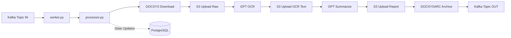
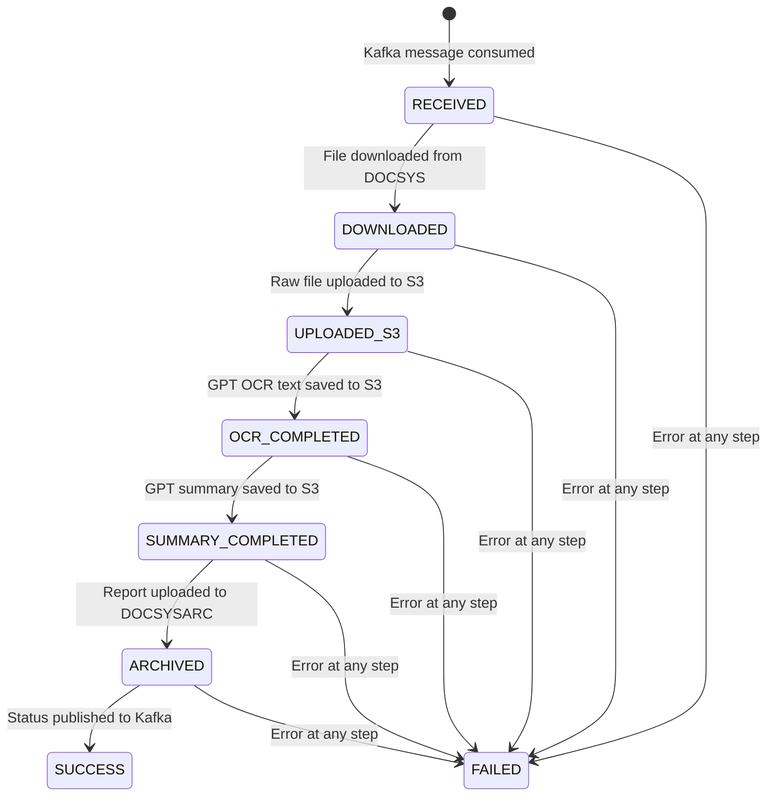

# OCR Summary Worker — OpenShift Event-Driven Pipeline

Async Kafka-driven pipeline that downloads documents from DOCSYS, runs OCR and summarization via Secure GPT, archives results to DOCSYSARC, and publishes completion status back to Kafka. PostgreSQL tracks job state at every step for audit/recovery.

## Architecture Overview



## Project Structure

```
python-ocr-summary-worker-openshift/
├── app/
│   ├── __init__.py
│   ├── worker.py                  # Entry point — Kafka consumer loop
│   ├── config.py                  # Pydantic Settings — all env vars
│   ├── pipeline/
│   │   ├── __init__.py
│   │   └── processor.py           # Main orchestrator — 7-step workflow
│   ├── services/
│   │   ├── __init__.py
│   │   ├── docsys_service.py      # DOCSYS + DOCSYSARC API client
│   │   └── gpt_service.py         # Secure GPT API client (OCR + Summary)
│   └── core/
│       ├── __init__.py
│       ├── database.py            # PostgreSQL — asyncpg pool + state machine
│       ├── s3_client.py           # S3 via VPC Endpoint — boto3 streaming
│       └── kafka_producer.py      # Kafka output producer — aiokafka
├── docs/
│   ├── implementation_plan.md     # This file
│   ├── sequence_diagram.mermaid   # Mermaid-formatted sequential flow
│   ├── er_diagram.mermaid         # Mermaid-formatted state machine schema
│   ├── decoupled_worker_design.md # Multi-pod scaling architectural design document
│   └── docker_compose_design.md   # Local development compose and mock design document
├── mocks/                         # FastAPI mock APIs for offline local testing
│   ├── docsys/                    # Mock download service
│   ├── docsysarc/                 # Mock archival service
│   ├── gpt/                       # Mock OCR & summary service
│   └── oidc/                      # Mock M2M authentication provider
├── Dockerfile                     # Non-root, OpenShift-ready
├── docker-compose.yml             # Local docker compose orchestration stack
├── requirements.txt
├── .env.example
├── .env.compose                   # Environment configuration for docker compose
└── README.md
```

## Proposed Changes

### Config Layer

#### [NEW] app/config.py
- Pydantic `BaseSettings` with `SettingsConfigDict(env_prefix="", case_sensitive=False)`
- Groups: Kafka (brokers, topics, group_id, security), Postgres (DSN), S3 (bucket, endpoint_url, region, credentials), DOCSYS (base_url, token), DOCSYSARC (base_url, token), GPT (base_url, api_key, model, timeout, max_retries)
- Singleton accessor `get_settings()`

---

### Core Infrastructure Layer

#### [NEW] app/core/database.py
- `asyncpg` connection pool via `asyncpg.create_pool()`
- `init_db()` — creates the `job_states` table if not exists (columns: `id`, `docid`, `fileid`, `state`, `s3_raw_key`, `s3_ocr_key`, `s3_report_key`, `error_message`, `created_at`, `updated_at`)
- `update_job_state(job_id, state, **extras)` — upsert state with timestamp
- `get_job_state(job_id)` — retrieve current state for recovery
- `create_job(docid, fileid)` → returns `job_id`

#### [NEW] app/core/s3_client.py
- `boto3` client initialized with explicit `endpoint_url` from env (VPC Endpoint support)
- `upload_stream(key, stream, content_type)` — multipart upload via `upload_fileobj()` for memory efficiency
- `download_stream(key)` → returns `StreamingBody` for streaming reads
- `generate_key(job_id, stage, extension)` — consistent S3 key pattern: `jobs/{job_id}/{stage}.{ext}`

#### [NEW] app/core/kafka_producer.py
- `aiokafka.AIOKafkaProducer` wrapper
- `publish_status(topic, payload: dict)` — JSON-serialize and send to output topic
- Graceful start/stop lifecycle

---

### Services Layer

#### [NEW] app/services/docsys_service.py
- `httpx.AsyncClient` with streaming
- `download_document(docid, fileid)` → returns async byte stream + content_type + filename
- `archive_document(docid, fileid, report_stream, filename)` — POST multipart upload to DOCSYSARC

#### [NEW] app/services/gpt_service.py
- `httpx.AsyncClient` with long timeout (configurable, default 300s)
- `tenacity` retry decorator: `retry(stop=stop_after_attempt(N), wait=wait_exponential(...), retry=retry_if_exception_type(...))`
- `perform_ocr(document_bytes)` → returns OCR text string
- `generate_summary(ocr_text)` → returns summary report text
- Both methods stream request bodies where applicable

---

### Pipeline Layer

#### [NEW] app/pipeline/processor.py
- `process_document(docid, fileid)` — main orchestrator, executes steps 2-7 sequentially
- Each step wrapped in try/except; on failure, updates DB state to `FAILED_{STEP}` with error message, then re-raises
- Recovery-aware: checks current DB state on entry, skips already-completed steps (idempotent resume)
- State transitions: `RECEIVED → DOWNLOADED → UPLOADED_S3 → OCR_COMPLETED → SUMMARY_COMPLETED → ARCHIVED → SUCCESS`

---

### Entry Point

#### [NEW] app/worker.py
- `aiokafka.AIOKafkaConsumer` infinite loop
- Manual commit after successful processing
- Graceful shutdown via `signal` handlers (SIGTERM/SIGINT)
- Structured logging (`structlog` or stdlib `logging` with JSON formatter)
- Initializes DB pool, S3 client, Kafka producer on startup; tears down on shutdown

---

### Deployment

#### [NEW] Dockerfile
- Multi-stage: `python:3.12-slim` base
- Non-root user (`uid=1001`) for OpenShift SCC compliance
- `COPY requirements.txt` → `pip install --no-cache-dir` → `COPY app/`
- `CMD ["python", "-m", "app.worker"]`

#### [NEW] requirements.txt
- `aiokafka`, `asyncpg`, `boto3`, `httpx`, `pydantic-settings`, `tenacity`, `structlog`

#### [NEW] .env.example
- Documented template of all required environment variables

---

## Key Design Decisions

| Concern | Decision |
|---|---|
| **Async runtime** | Full `asyncio` — `aiokafka` + `httpx.AsyncClient` + `asyncpg`. Single-threaded, no GIL contention. |
| **Memory** | Stream files via `httpx` streaming + `boto3 upload_fileobj` + chunked reads. Never hold full document in memory. |
| **Retries** | `tenacity` on GPT calls only (external, flaky). DOCSYS/S3 failures fail the job immediately (infrastructure issues). |
| **State machine** | PostgreSQL row per job with state enum. On recovery, `processor` reads current state and resumes from the last incomplete step. |
| **S3 VPC Endpoint** | `boto3.client('s3', endpoint_url=settings.s3_endpoint_url)` — standard pattern for private endpoints. |
| **OpenShift** | Non-root UID 1001, no privilege escalation, read-only FS compatible (runs entirely in-memory). |

## State Machine Transitions



## Verification Plan

### Automated Tests
```bash
python -c "from app.config import get_settings; print('Config loads OK')"
docker build -t ocr-worker:test .
```

### Manual Verification
- Review that all files parse without syntax errors
- Confirm Dockerfile builds successfully
- Validate env var coverage against `.env.example`
